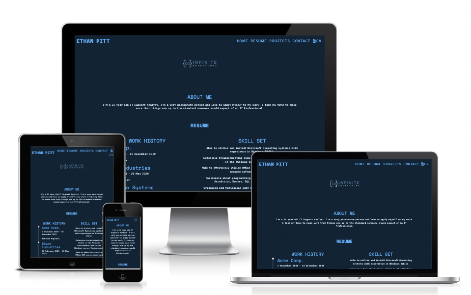
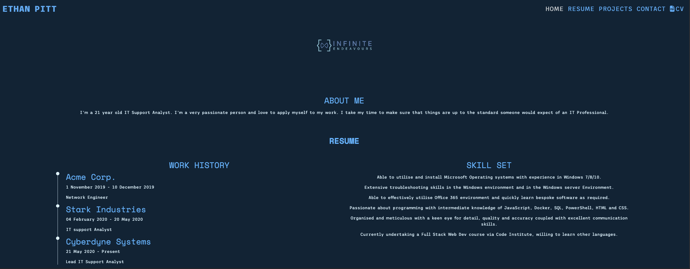
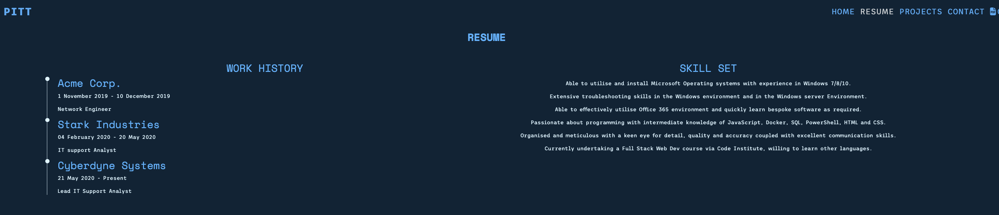

# Ethan Pitt Personal Portfolio Site

This website is designed to act as a Personal Portfolio site for myself, which will be responsive on a variety of devices. It will allow prospective employers to review my work history and the projects I have completed.

---

# Contents

* [User Experience](#user-experience)

    * [Project Discussion](#project-discussion)

    * [User Stories](#user-stories)

* [Design / User Interface](#design)

    * [Color Palette](#color-palette)

    * [Typography](#typography)

    * [Features](#features)

    * [Images](#images)

    * [Wireframes](#wireframes)

    * [Accessibility](#accessibility)

* [Technologies](#technologies)

    * [Languages Used](#languages-used)

* [Deployment & Development](#deployment-and-development)

    * Local Development

    * [Development](#development)

    * [Deployment](#deployment)

* Testing

    * [Feedback](#feedback)

    * [Bugs](#bugs)

    * [Validation](#validation)

    * [Testing User Stories](#testing-user-stories)

    * [Lighthouse](#lighthouse)

    * Manual Testing

---

# User Experience

## Project Discussion

This website is an online portfolio for myself, where I can showcase the skills I have learnt, along with my work history and projects that I have completed in my personal time.

Key Goals:

* To be able to present my work history

* To be able to provide a copy of my CV Employers can access.

## User Stories

### Client Goals

* To make the site viewable on different devices (Mobile/Tablet/Desktops)

* To make it easy for an employer or recruiter to

* To display the client's skill sets.

* To display projects the client has taken part in and completed.

* To display upcoming projects.

### First Time Visitor

* I want to be able to view the persons work history and skill set without needing to see a CV.

* I want to be able to contact the person easily.

* I want to be able to download a copy of the persons CV.

* I want to be able to navigate the site easily.

### Returning Visitor

*  I should be able to quickly locate important information such as the persons skill set so I can show this to someone else.

---

# Design

## Color Palette

The palette I am using is based [off of this palette](https://colorhunt.co/palette/06283d1363df47b5ffdff6ff), however the secondary color, #47B5FF, has been modified to #57BCFF, which allows it to pass WebAIM WCAG AAA standards on a black background while still sticking to the original theme.

## Typography

. 'Space Mono' font from Google Fonts. This will be used for headings. It is a monospace font.

. 'Trispace' font from Google Fonts. This will be used for the body text. This is a sans-serif font.

## Features

The website will feature 3 pages, which are accessible from the home page via navigation links (Home, Resume and Projects). The site will also feature a downloadable copy of a CV.

* All pages will contain the following:

    * A responsive navigation bar which will allow the user to traverse the site using the buttons located on top of the pages banner.

    * A footer at the bottom of the page, which will feature a small brief about the client, a link to their CV and links to social media (Github, Twitter, Email etc).

* Home Page

    * The home page will feature three blurbs about the client, such as a brief about the client, what their motivation is and what their goals are in the future.

* Resume

    * This page will feature a horizontal timeline for the client's work history.

    * A section about the client's skills, which will consist written text.

* Projects

    * Two sections covering a project the client has completed as well as a project the client is going to be working on.

* Contact

    * Contains a form which allows a recruiter or user to establish communication with the client.

## Images

The image used on this site was created by myself as a logo for my username.

## Wireframes

The Wireframes for this site can be found [here](docs/wireframes/wireframes.pdf).

## Accessibility

I will aim to keep the site accessible to all users by doing the following:

* Making sure all colours contrast each other nicely and pass the [WebAIM contrast checker](https://webaim.org/resources/contrastchecker/) tests.

* Using Semantic HTML throughout the site.

* Ensuring Screen Readers are accounted for by including the necessary aria attributes and creating custom classes.

* Providing alternative text for any images or icons that are used.

---

# Technologies

## Languages Used

HTML and CSS were used to create the website and style it.

## Frameworks, Programs and Libraries used

* Bootstrap Version 5.2 - Framework used for the website. The Navbar, Timeline, Footer and main sections were created using Bootstraps grid systems. These were modified and then styled using my own style sheet.

* Balsamiq - Used to create wireframes for the website.

* Git - Version Control Software.

* GitHub - Online repository.

* Gitpod - Online IDE.

* Font Awesome - Used for icons which are found in the footer.

* Google Dev Tools - Used for troubleshooting HTML/CSS.

* Firefox Dev Tools - Used for troubleshooting CSS.

* Compressor.io - Used to compress the logo image from 7KB to 1KB.

---

# Deployment and Development

## Development

All development was done using [gitpod](https://gitpod.io).

To use Gitpod for development, I performed the following;

1. Created a repository using the template provided by Code Institute.

2. Logged into Gitpod and selected 'New Workspace'.

3. Wait for Gitpod to build the container image.

4. Start development once loaded.

## Local Development

Although I did not do any developement on my local machine, here are the steps to follow if you wish to create a local development environment. 

1. Log into GitHub.

2. Copy the Repository URL.

3. Enter your terminal and change to the directory you wish to work in.

4. Enter `git clone` into the terminal and then paste the URl from step 2.

`$ git clone https://github.com/InfiniteEndeavours/Portfolio-Site`

5. Press enter and the repoistory will be cloned to your local device.

`$ git clone https://github.com/InfiniteEndeavours/Portfolio-Site
Cloning into 'Portfolio-Site'...
remote: Enumerating objects: 311, done.
remote: Counting objects: 100% (311/311), done.
remote: Compressing objects: 100% (133/133), done.
remote: Total 311 (delta 149), reused 303 (delta 143), pack-reused 0
Receiving objects: 100% (311/311), 8.59 MiB | 17.74 MiB/s, done.
Resolving deltas: 100% (149/149), done.`

6. If you set up VSCode in your path, you can then type `code Portfolio-Site` to enter a VSCode session in the repository.

## Deployment

I used GitHub Pages to deploy the live site. To do this I performed the below;

1. Logged into Github.

2. Navigated to the website repository.

3. Went into 'Settings'.

4. Clicked on the 'Pages' setting.

5. Selected the Main branch and set the folder to /root (Default). Then clicked save.

6. After the build process is compelte the site is reachable in the URL displayed at the top of the page.

---

# Testing

Throughout the build of the website, I utilised both Chrome and Firefox development tools to help troubleshoot any HTML or CSS issues I encountered.

When asking for a peer to review the website on Slack, the following was raised:

* Simen Daehlin suggested making the website more mobile friendly by having multiple sections on one scrolling page, instead of separate pages.

* Simen also suggested moving away from using absolute measurements in the CSS file to using relative measurements, which would allow for better scaling across devices.

## Feedback

The following feedback was given from the Slack community after raising a question in regards to forms.

* Instead of submitting the contact form to the Code Institute Form Dump, it should instead redirect to a 'Thank you' page. This was mainly raised for privacy concerns as it is not a server I have access too. This has now been changed and users are redirected to a thank you page.

## Bugs

* Known Issues

    * When viewing on a device that is less than 321 pixels in width, the Navbar does not scale correctly with the rest of the elements, causing content to be pushed to the left of the page. As most modern devices have a vertical width over 320px I don't foresee this being an issue.

    * When on a mobile device and using the collapsed navbar, clicking on a nav item will take a user to the desired section but won't close the navbar. After investigation this seems to be default Bootstrap behaviour.

* Solved Bugs

    * Navbar Brand - When the navbar menu was expanded, the Navbar items would be too far to the right of the screen and not be centered as it should have been. To resolve this, I added a margin offset based on the width and existing margin or the Navbar Brand. Credit to **DaveHorrocks_5P** on Slack for helping me to resolve this issue.

    * On smaller devices, if you wanted to visit a new page you needed to scroll back to the top of the page to change page. As this wasn't very easy for mobile users I have now condensed the site into one static page with anchor points throughout. To accompany this I have also made the navigation bar fixed to the top of the screen, so it is accessible no matter what section of the page the user is on.

    * After a request for a peer review on Slack, Simen Daehlin pointed out scalability issues. This was due to the use of measurements using pixels, due to this, small devices were scaling incorrectly. This was resolved by moving away from pixel measurements and instead using rem.

    * When viewing the site on a device in portrait mode and going below 250 pixels in width, the logo was not resizing. To resolve this I added the Bootstrap class `img-fluid` to the `img` element. This issue can be seen below.

## Validation

For validation of the website's HTML and CSS, I used W3C's HTML and CSS Validators.

* [HTML Validation (index.html)](docs/testing/w3cIndexValidation.png)

* [HTML Validation (thank-you.html)](docs/testing/w3cThankYouValidation.png)

* [CSS Validation (style.css)](docs/testing/cssValidation.png)

## Testing User Stories

### First Time Visitor

* I want to be able to view the persons work history and skill set without need to see a CV.
    * The user can achieve this by either scrolling down to the Resume section, or by using the navigation links at the top of the page.
    
    

* I want to be able to contact the person easily.
    * The user can achieve this by either scrolling down to the Contact section, or by using the navigation links at the top of the page. There are 3 required fields the user needs to fill in. These are their name, email and the message they wish to send to the site owner.
    
    

* I want to be able to download a copy of the persons CV.
    * The user can achieve this by either clicking on the CV Navigation link, or by using the download icon in the footer. Both options allow a user to view the CV in their browser which can then be printed or downloaded.
    
    

* I want to be able to navigate the site easily.
    * The user can easily navigate the site by simply scrolling up or down as it is a one page site. This makes it mobile friendly. The user can also navigate to specific sections using the navbar.

### Returning Visitor

* I should be able to quickly locate important information such as the persons skill set, so I can show it to someone else.
    * The user can easily locate this information by using the navbar at the top of the page which will hyperlink to the desired section.

    

## Lighthouse

I used the Lighthouse testing suite in Google Chrome Developer Tools to test the performance, accessibility and SEO of my site. I also used it to ensure I was following best practices.

### Index Page

* Lighthouse Desktop Result

* Lighthouse Mobile Result

### Thank You Page

* Lighthouse Desktop Result

* Lighthouse Mobile Result

### Observations

There is a slight performance disparity between the lighthouse scores depending on what type of device was being tested. 

On mobile devices, the performance score was consistently lower than the desktop view to the large size of the Bootstrap CSS file.

It's possible to remove the critical CSS from the Bootstrap CSS file and load these in to a smaller CSS sheet, then load the rest of the Non-Critical styling after critical styling has been loaded, however I feel that the site is fast enough on mobile devices to not warrant this.

## Manual Testing

For manual testing, I used 3 devices with different screen resolutions across three different browsers. These were:

* Desktop - 3440 x 1440 - Google Chrome, Safari, Firefox
* Laptop - 2560 x 1600 - Google Chrome, Safari, Firefox
* Mobile - 1284 x 2778 (Portrait) and 2778 x 1284  (Landscape) - Google Chrome, Safari, Firefox

### Testing Process

### Responsiveness and viewing:

I went through both pages on my desktop and laptop and could observe no issues with responsiveness or elements being out of place.

On the portrait view of mobile this was also the case, however on the landscape mobile view, specifically on the Thank You page, the footer was clipping through the thank you text.

To resolve this, I added a class to the footer on this page and changed the position from 'Absolute' to 'Relative'. This resolved the clipping issue by allowing the footer to sit below the thank you message element.

### Hyperlinks

I visited each page page and confirmed that all links worked correctly. Links that lead to an external site, or that opened a document (such as PDF) worked correctly and opened in a separate tab.

### Contact Form

1. I tried to submit the form without any information and was prompted by a pop-up error informing me I need to enter my name.

2. I filled in my name and tried to submit the form again, recieving an error that the email field was empty.

3. I populated the email field with the word 'email' and tried to submit the form again. I was informed that it was not a valid email address.

4. After entering a valid email address, I once again tried to submit the form, where I reiceved an error as there was nothing populated in the message box.

5. After populating all fields with validate data, I was able to submit the form and was successfuly redirected to the thank you page.

---

# Credits

## Code

* Bootstrap 5: This library was used to make the site more responsive by utilising the Grid System.

## Content

* All content for this website was written by Ethan Pitt.

* Employment History was generalised and used fake companies found [here](https://time.com/4351022/influential-fake-companies/).

## Media

Images used are property of Ethan Pitt.

## Acknowledgments

* [Dave Horrocks](https://github.com/daveyjh) - For his help in resolving a Navbar margin issue.

* [Simen Daehlin](https://github.com/Eventyret) - For this recommendations on making the site more mobile friendly and for his peer review on slack.

* Jack Wachira - My Code Institute Mentor for his feedback on the project.

* [Kera Cudmore](https://github.com/kera-cudmore) - For helping me resolve issues encountered when trying to perform Lighthouse testing.